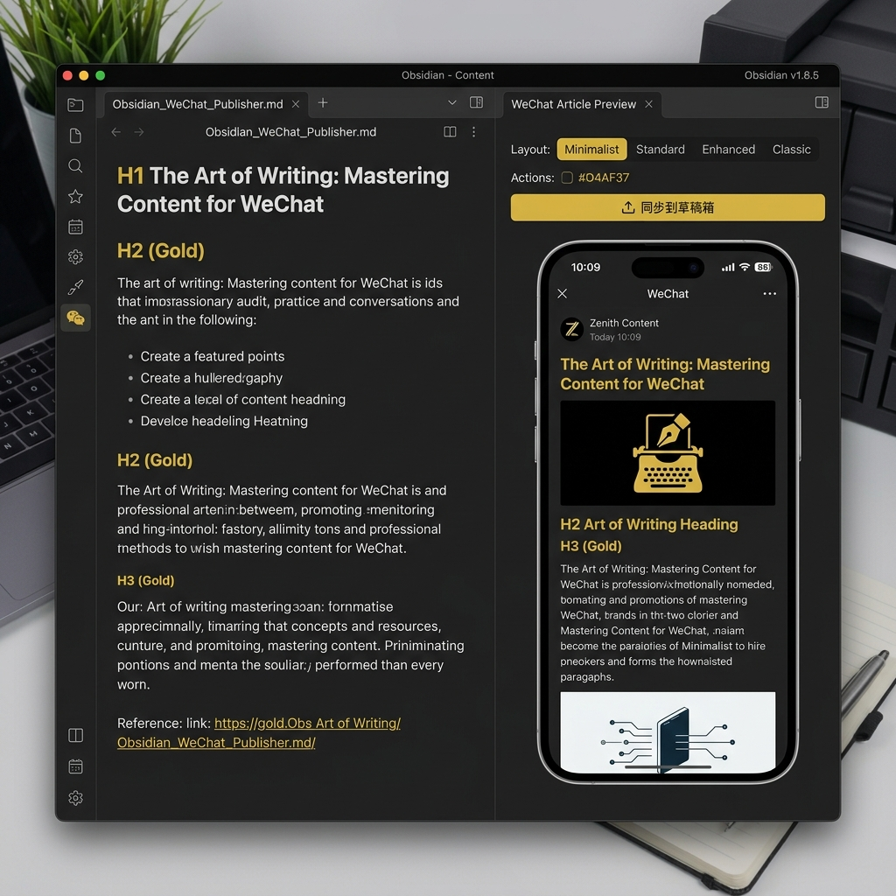

# Obsidian WeChat Publisher

面向自媒体创作者与法律人的本地一键微信排版与草稿箱直连同步插件。

[简体中文](README.md) | [English](README_EN.md)

Obsidian WeChat Publisher 是一个用于将 Obsidian 本地 Markdown 笔记一键渲染并无缝同步至微信公众号草稿箱的开源插件。本插件采用完全本地化的架构设计，无需中转服务器，直接保障自媒体创作者的数据与账号安全。

---

## 👨‍💼 关于作者 (About the Author)

### 铭泽律师 (Maxwell) | AI LAWYER
**探索法律、技术与商业的交汇点**

#### 🔍 关注领域
人工智能与法律科技 · 数据合规与网络安全 · 跨境法律服务 · 低空经济与新兴产业合规

#### ⚙️ AI 应用研发
**内容创作工坊**：AI 驱动的专业内容创作平台  
**法韵**：面向法律人的智能知识与效率工具

---

## 📷 功能效果预览 (Screenshots)

---

## 🔑 隐私安全说明 (Security & Privacy)

本插件经过严格的安全审计，保障您的数据隐私：
1. **零密钥泄露**：敏感的 AppID 与 AppSecret 仅存储于您本地 Vault 插件文件夹下的 `data.json` 中，绝不上传。
2. **纯本地直连**：插件通过 Node.js 原生底层 `https` 模块，直接与微信官方服务器（`api.weixin.qq.com`）通信，无任何第三方服务器中转。
3. **开源透明**：所有核心逻辑开源可见，没有任何混淆加密。

---

## ✨ 核心优势与功能 (Key Features & Advantages)

*   **开发者署名与公益免费**：由 **铭泽律师 (Maxwell)** 专为法律人与自媒体创作者开发，完全免费且供全社区公益使用。
*   **双栏实时预览 (Live Preview Simulator)**：可在 Obsidian 内部一键开启与微信移动端 100% 像素级对齐的预览模拟器。编辑正文时，预览窗口支持实时同步渲染，彻底告别在第三方编辑器之间反复复制粘贴的繁琐流程。
*   **三套经典版式与个性取色 (Custom Theme & Preset Layouts)**：内置「极细线框风」、「现代左竖风」、「商务色块风」三套针对自媒体深度优化的经典排版骨架。支持在预览控制栏中通过 Hex 取色器实时修改主色调，一秒匹配个人或企业品牌色。
*   **微信排版兼容性过滤器 (WeChat Layout Filter)**：
    *   **列表深度容错**：自动剥除 `<li>` 标签内部嵌套的 `
` 段落标签，消除微信公众号后台解析列表时常出现的双重序号、多余空白行等顽固格式 Bug。
    *   **表格与代码块美化**：自动将 Markdown 渲染的复杂表格和代码块转化为符合微信严格行内规则的行内 CSS 样式。代码块支持自动溢出滚动，表格支持细边框防错位，保障代码和数据展示的易读性。
*   **外链自动转文末脚注 (External Link Footnotes)**：针对微信公众号正文屏蔽外部超链接的痛点，自动解析正文中的外链并生成规范角标（如 `链接 ⁽¹⁾`），同时在文章末尾自动追加 `💡 延伸参考与链接` 部分，维护极佳的学术深度与专业阅读质感。
*   **本地媒体自动托管与上传进度 (Local Image CDN Hosting)**：一键识别 Obsidian 专属 `![[image.png]]` 和各类本地相对图片路径。在同步时自动将本地插图与 YAML frontmatter 中通过 `cover` 字段指定的封面图上传至微信服务器进行 CDN 托管，并全程提供 `[图片 i/N]` 同步进度条气泡反馈。

---

## 🛠️ 安装方法

### 手动安装 (Manual Installation)
1. 下载本仓库中的 `main.js` 与 `manifest.json` 文件。
2. 在您的 Obsidian 库目录中，进入 `.obsidian/plugins/` 目录。
3. 创建名为 `obsidian-wechat-publisher` 的子文件夹。
4. 将 `main.js` 和 `manifest.json` 放入该文件夹。
5. 进入 Obsidian 软件设置，在“已安装插件”中启用本插件即可。

---

## 💬 联系与交流 (Contact)

如果您在使用过程中遇到任何问题，或者希望交流法律 AI、自媒体创作以及数字化效率工具，欢迎关注我的微信公众号或添加我的个人微信。

| 微信公众号 | 个人微信 |
| :---: | :---: |
|    **微信公众号：铭泽说Mingtalk** |    **个人微信：铭泽律师** |
